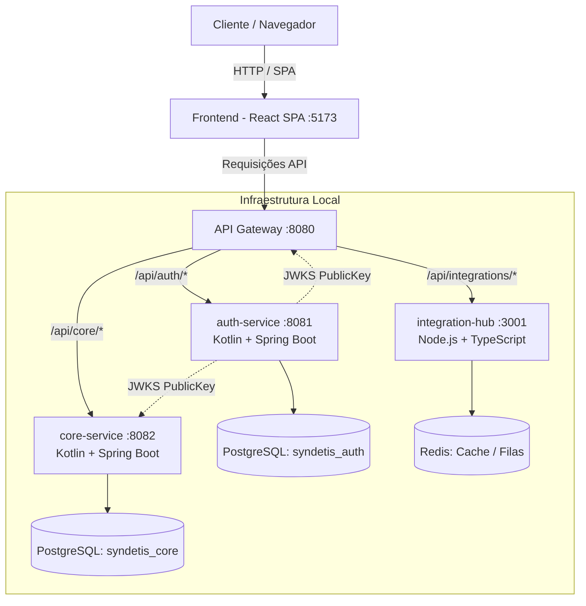

# Syndetis Web Platform

[](https://github.com/veltonMonte/Syndetis_Project_Web/actions)


> Plataforma SaaS multi-domínio para criação, gestão e personalização de **lojas virtuais (e-commerce)**.

O grande diferencial da plataforma é a **Sessão Maker**: uma interface de customização visual modular onde as escolhas de layout, paletas, animações e cards são serializadas em objetos JSON, persistidas em colunas `JSONB` no PostgreSQL e interpretadas dinamicamente pelo frontend, permitindo lojas personalizadas sem necessidade de novo deploy.

---

## 🏛️ Arquitetura de Microsserviços

O ecossistema é baseado em microsserviços desacoplados e poliglotas:



### Serviços

| Serviço | Stack | Porta | Descrição |
|---|---|---|---|
| **[frontend/](file:///frontend)** | React + TypeScript + Vite | `5173` | SPA para vitrine, checkout e Sessão Maker |
| **[gateway/](file:///gateway)** | API Gateway | `8080` | Ponto único de entrada, roteador e validação de tokens via JWKS |
| **[services/auth-service/](file:///services/auth-service)** | Kotlin + Spring Boot | `8081` | Autenticação local, OAuth2 (Google/GitHub) e emissão de JWT (RS256) |
| **[services/core-service/](file:///services/core-service)** | Kotlin + Spring Boot | `8082` | Regras de negócio, catálogo, pedidos, estoque e layouts JSONB |
| **[services/integration-hub/](file:///services/integration-hub)** | TypeScript + Node.js | `3001` | Hub assíncrono para Correios, WhatsApp, Gmail e webhooks |

---

## 📂 Estrutura do Monorepo

```text
Syndetis_Project_Web/
├── .github/                      # Workflows de CI/CD e templates de issues/PRs
├── docker/                       # Scripts de inicialização de containers
│   └── postgres/init-databases.sh
├── gateway/                      # Configurações do API Gateway
├── libs/                         # Bibliotecas e utilitários compartilhados
│   ├── common/                   # DTOs e exceptions reutilizáveis
│   └── jwt-utils/                # Validação de JWT utilitária
├── services/
│   ├── auth-service/             # Microsserviço de autenticação e identidade
│   ├── core-service/             # Microsserviço de domínio e Sessão Maker
│   └── integration-hub/          # Microsserviço de integrações externas
├── frontend/                     # Aplicação web React SPA
├── docker-compose.yml            # Orquestração de bancos e infraestrutura local
├── .editorconfig                 # Padronização de formatação entre editores
├── .gitattributes                # Normalização de quebras de linha (LF)
├── .gitignore                    # Regras de exclusão globais
├── CONTRIBUTING.md               # Guia de branches, commits e PRs
└── AGENTS.md                     # Especificação técnica e regras de arquitetura
```

---

## 🚀 Como Executar Localmente

### Pré-requisitos
* [Docker](https://www.docker.com/) e Docker Compose
* [JDK 21](https://adoptium.net/) (para os serviços em Kotlin/Spring Boot)
* [Node.js 20+](https://nodejs.org/) (para o frontend e o integration-hub)

### 1. Iniciar a infraestrutura (PostgreSQL + Redis)

```bash
# Sobe os containers de PostgreSQL (com bancos syndetis_auth e syndetis_core criados) e Redis
docker compose up -d
```

### 2. Iniciar os Microsserviços

Cada serviço roda de forma independente:

```bash
# Terminal 1 - Auth Service
cd services/auth-service
./mvnw spring-boot:run

# Terminal 2 - Core Service
cd services/core-service
./mvnw spring-boot:run

# Terminal 3 - Integration Hub
cd services/integration-hub
npm install && npm run dev

# Terminal 4 - Frontend
cd frontend
npm install && npm run dev
```

---

## 🛠️ Padrões e Contribuição

Antes de abrir Pull Requests ou criar branches, leia as diretrizes:
* [Guia de Contribuição e Git Flow](file:///CONTRIBUTING.md)
* [Convenções Técnicas e Arquitetura no AGENTS.md](file:///AGENTS.md)

---

## 📄 Licença

Este projeto é desenvolvido para a disciplina de Integração de Sistemas. Todos os direitos reservados.
