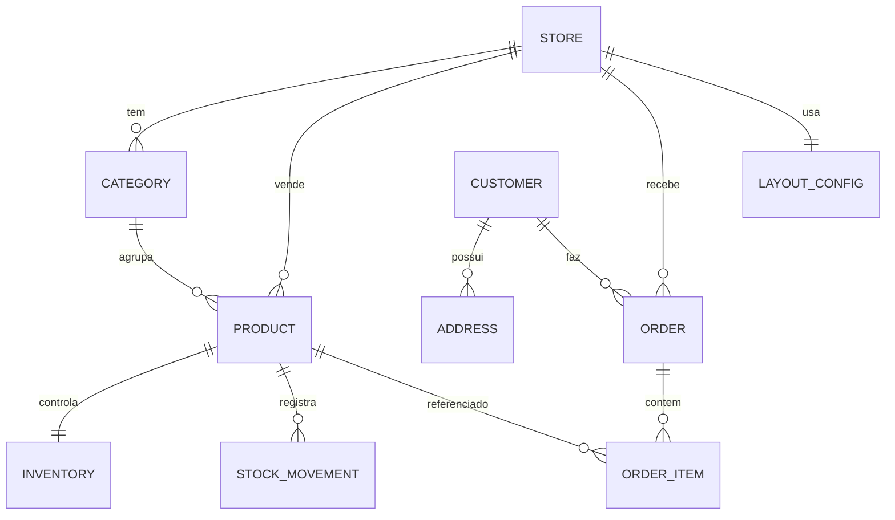
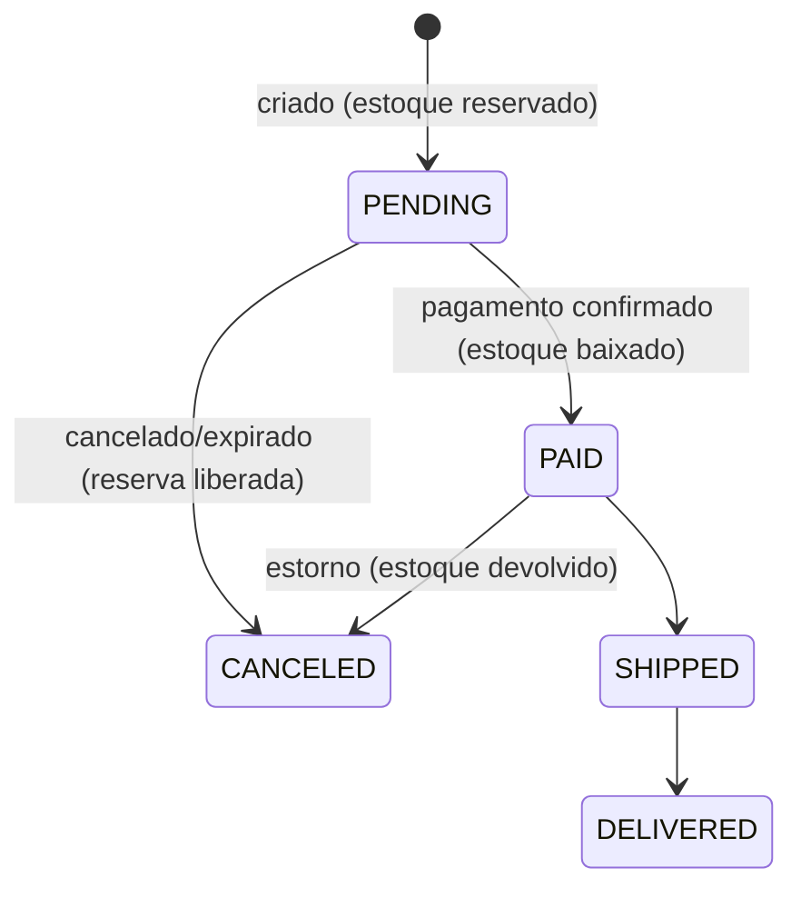

# Plano — core-service

Serviço de regras de negócio da plataforma: **lojas, produtos, estoque, clientes, pedidos e o `layout_config` da Sessão Maker**.

## 1. Situação atual

- `services/core-service/` tem só as pastas vazias (`.gitkeep`) no pacote `com.syndetis.core`.
- Ainda não existe build (`pom.xml`), `Application.kt` nem `application.properties`.
- O banco `syndetis_core` já é criado pelo [init-databases.sh](../../docker/postgres/init-databases.sh).
- O `auth-service` emite JWT com `sub` = id do usuário e as claims `email` e `role` (`ADMIN`, `SELLER`, `CUSTOMER`).

## 2. Stack

| Item | Escolha |
|---|---|
| Linguagem / Framework | Kotlin + Spring Boot 4.1 (mesma versão do auth) |
| Build | Maven (igual ao auth-service) |
| Java | 21 |
| Banco | PostgreSQL `syndetis_core` (JSONB para layout) |
| Migrations | Flyway (`V1__...`, `V2__...`) |
| Segurança | OAuth2 Resource Server — só **valida** JWT, não emite |
| Validação | Jakarta Validation nos DTOs |
| Documentação | springdoc-openapi (Swagger UI) |
| Testes | JUnit 5 + Testcontainers (Postgres) |
| Porta | `8082` |

## 3. Domínio

| Entidade | Campos principais | Observações |
|---|---|---|
| **Store** | `id`, `owner_user_id`, `name`, `slug` (único), `type`, `status`, `created_at` | `type`: `ECOMMERCE`, `MENU`, `EVENT`. `owner_user_id` vem do JWT (sem FK — outro banco) |
| **LayoutConfig** | `store_id`, `config` (JSONB), `version`, `updated_at` | Sessão Maker; versão para controle de concorrência |
| **Category** | `id`, `store_id`, `name`, `slug`, `position` | |
| **Product** | `id`, `store_id`, `category_id`, `name`, `description`, `price` (`NUMERIC(12,2)`), `sku`, `image_url`, `active` | Exclusão lógica via `active` |
| **Inventory** | `product_id`, `quantity`, `reserved` | `available = quantity - reserved` |
| **StockMovement** | `id`, `product_id`, `type`, `quantity`, `reason`, `order_id`, `created_at` | `type`: `IN`, `OUT`, `RESERVE`, `RELEASE`, `ADJUST`. Histórico/auditoria |
| **Customer** | `id`, `user_id` (opcional), `name`, `email`, `phone`, `document` | `user_id` nulo permite checkout como convidado |
| **Address** | `id`, `customer_id`, `zip_code`, `street`, `number`, `city`, `state`, `complement` | Usado depois no frete (integration-hub) |
| **Order** | `id`, `store_id`, `customer_id`, `status`, `subtotal`, `shipping`, `total`, `created_at` | |
| **OrderItem** | `id`, `order_id`, `product_id`, `product_name`, `unit_price`, `quantity` | Nome/preço copiados no momento da compra |

### Ciclo de vida do pedido

## 4. Regras de negócio

- **Dono da loja**: só o `SELLER` dono (`owner_user_id == sub` do JWT) ou `ADMIN` altera a loja, produtos, estoque e layout.
- **Estoque**: criar pedido **reserva**; pagar **baixa**; cancelar **libera**. Nunca deixa `available` negativo.
- **Concorrência**: reserva usa lock pessimista (`SELECT ... FOR UPDATE`) na linha de `inventory` para evitar vender o mesmo item duas vezes.
- **Preço**: o total é sempre recalculado no servidor; o frontend nunca manda preço.
- **Transições de status**: validadas numa máquina de estados; transição inválida → `409 Conflict`.
- **Slug** da loja único globalmente (será usado na URL pública da vitrine).

## 5. Endpoints

**Públicos (vitrine, sem token)**
- `GET /api/public/stores/{slug}` — dados + `layout_config`
- `GET /api/public/stores/{slug}/products` — paginado, filtro por categoria
- `GET /api/public/stores/{slug}/products/{id}`

**Painel do lojista (`SELLER`/`ADMIN`)**
- `POST/GET/PUT /api/stores`, `GET /api/stores/me`
- `GET/PUT /api/stores/{id}/layout` — Sessão Maker
- `CRUD /api/stores/{id}/categories`
- `CRUD /api/stores/{id}/products`
- `GET /api/stores/{id}/inventory`, `POST /api/stores/{id}/inventory/{productId}/movements`
- `GET /api/stores/{id}/orders`, `PATCH /api/stores/{id}/orders/{orderId}/status`

**Cliente (`CUSTOMER`)**
- `GET/PUT /api/customers/me`, `CRUD /api/customers/me/addresses`
- `POST /api/orders` — cria pedido e reserva estoque
- `GET /api/orders/me`, `GET /api/orders/{id}`, `POST /api/orders/{id}/cancel`

Erros padronizados pelo `GlobalExceptionHandler` (`400`, `401`, `403`, `404`, `409`). JSON inválido (`HttpMessageNotReadableException`) responde `400`.

## 6. Fases de entrega

| Fase | Entrega | Branch sugerida |
|---|---|---|
| **0. Setup** | `pom.xml`, `CoreApplication.kt`, `application.properties`, conexão no `syndetis_core`, Flyway, health check, Swagger | `feat/core-setup` |
| **1. Segurança** | Resource Server validando o JWT do auth-service, conversão da claim `role` em authority, helper `currentUserId()` | `feat/core-security` |
| **2. Lojas + Layout** | `Store`, `LayoutConfig` (JSONB), endpoints públicos e do painel | `feat/core-stores` |
| **3. Catálogo** | `Category`, `Product`, paginação e filtros | `feat/core-catalog` |
| **4. Estoque** | `Inventory`, `StockMovement`, reserva com lock | `feat/core-inventory` |
| **5. Clientes** | `Customer`, `Address` | `feat/core-customers` |
| **6. Pedidos** | `Order`, `OrderItem`, máquina de estados, integração com estoque | `feat/core-orders` |
| **7. Infra** | Dockerfile, serviço no `docker-compose.yml`, job no CI, porta 8082 na EC2 | `feat/core-deploy` |

Cada fase fecha com migration própria e testes de integração (Testcontainers).

## 7. Fora deste plano (próximos passos)

- Pagamento real (gateway) — por enquanto `PAID` é marcado manualmente pelo lojista.
- Frete e notificações (e-mail/WhatsApp) — ficam no `integration-hub`, chamados pelo core via HTTP/fila.
- API Gateway na frente dos serviços.

## 8. Decisões tomadas

1. **Build: Maven**, para manter consistência com o `auth-service`. O `AGENTS.md` prevê Gradle Kotlin DSL; a migração dos dois serviços pode ser feita junto depois, se o grupo quiser.
2. **JWT: HS256 por enquanto**, com o mesmo `jwt.secret` do auth-service via variável de ambiente. A migração para RS256 + JWKS (prevista no `AGENTS.md`) fica como tarefa separada no auth.
3. **Pacote: `com.syndetis.core`** (já criado). O auth ainda usa `com.seuprojeto.auth`, que pode ser renomeado depois.

## 9. Pendências relacionadas

- No `auth-service`, JSON inválido (ex.: `role: "USER"`) responde **401** em vez de **400**. Corrigir separadamente.
